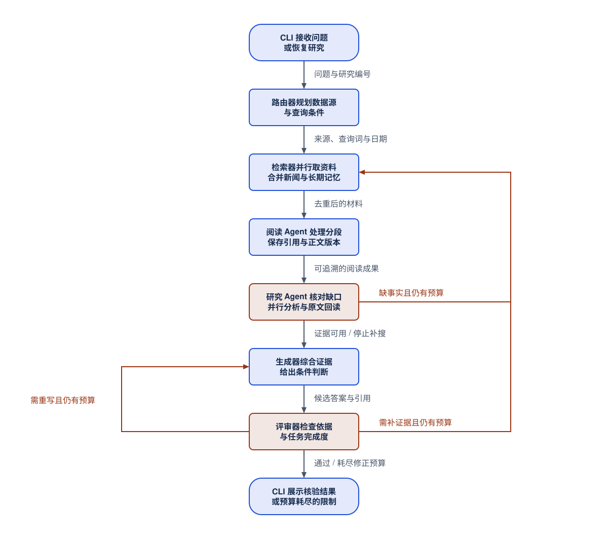
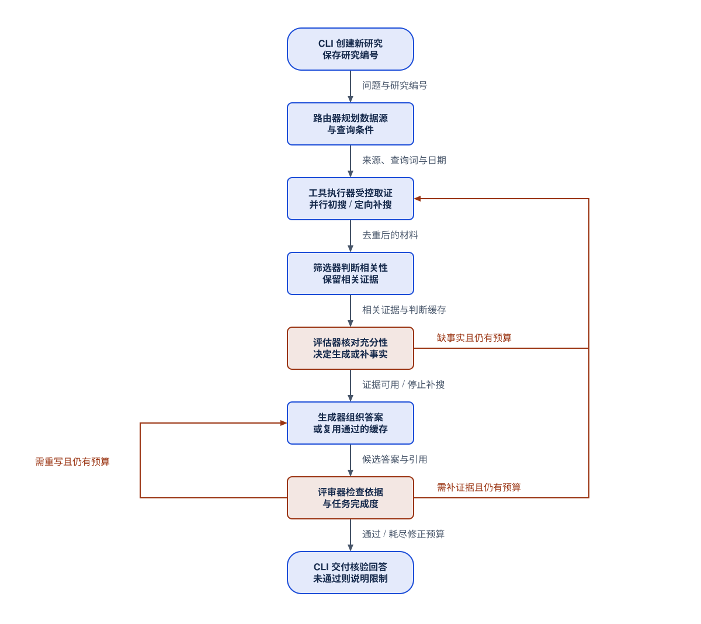

# 技术细节详解：从代码理解当前架构

本文描述当前工作区实现，不是早期版本说明。默认开启持久化研究模式；命令、默认值、版本号和完整节点连接见自动生成的[代码事实参考](reference.md)。学习导航见[文档首页](index.md)。

## 1. 一句话介绍

这是一个使用本机 Ollama 的多源证据研究工作流：模型规划要查什么，程序调用受约束的工具；阅读任务保存可追溯成果，专题任务分析不同因素；资料不足就有限补搜，答案不合格就有限重写。

工程价值不是框架名，而是**有状态、有预算、可复用、能追溯、有失败出口**。当前没有网页前端、任意 SQL 查询工具、自由 ReAct Agent 或分布式调度平台。

## 2. 各层职责

| 层次 | 实际职责 | 代码入口 |
|---|---|---|
| CLI | 收问题、预热模型、创建研究编号、恢复与展示事件 | [cli.py](../src/agentic_rag/cli.py) |
| 主图 | 阶段顺序、共享状态、补搜与重写分支 | [build.py](../src/agentic_rag/graph/build.py)、[state.py](../src/agentic_rag/graph/state.py) |
| 模型链 | 结构化规划、相关性、充分性、生成和评审 | [chains.py](../src/agentic_rag/graph/chains.py) |
| 工具 | Schema 校验、ToolCall / ToolMessage、证据与事件 | [工具目录](../src/agentic_rag/tools/__init__.py)、[工具说明](tools-guide.md) |
| 领域服务 | 新闻分页与排序、本地增量索引、答案缓存 | [news_retrieval.py](../src/agentic_rag/news_retrieval.py)、[ingestion.py](../src/agentic_rag/ingestion.py) |
| 研究服务 | 版本化阅读、任务键、专题回读、记忆召回 | [service.py](../src/agentic_rag/research/service.py) |
| 调度与存储 | 原子领取、租约、有限线程池、事务与向量待办 | [scheduler.py](../src/agentic_rag/research/scheduler.py)、[store.py](../src/agentic_rag/research/store.py) |

LangChain 组织节点内部的 Prompt、模型和工具协议；LangGraph 管节点之间的状态转移。`@tool` 不意味着模型直接自由调用函数：当前模型生成 `SourcePlan`，节点把它翻译成工具参数。

## 3. 当前两种执行模式

### 默认研究模式

1. CLI 初始化研究编号与 SQLite 检查点；`initialize_research` 确认模型版本、阅读配方和工作流版本。
2. `route` 生成多源计划、任务类型、查询词、时间建议及核对因素。
3. `recall_memory` 在选择新闻源且时间计划有效时召回已读新闻；它先于在线收集，不与整个在线阶段同时启动。
4. `collect_sources` 并行执行选中的三个来源，稳定合并结果；在线新闻优先于同 ID 的旧记忆。
5. `read_documents` 只为新闻材料建立分段阅读任务，复用已完成成果；方法文档和网页摘要不走新闻阅读任务。
6. `grade_documents` 筛相关性，`assess_evidence` 判断整批证据是否足够；不足且有预算时定向补搜，再回到阅读。
7. `dispatch_specialists` 为分析/预测问题创建专题任务。事实型问题或没有入选证据时跳过；专题可受限回读并建议补搜。
8. `generate` 创建或复用候选答案；`evaluate_generation` 检查依据和任务完成度，选择结束、补搜或重写。

图把“筛选、充分性、专题”合并成一个学习阶段；它不是节点一一对应图。精确边表见[代码事实参考](reference.md)。补搜不会重新运行初始路由或长期记忆召回，也不改写用户原始问题。

### 基础模式

设置 `RESEARCH_ENABLED=false` 后，跳过研究初始化、长期记忆、分段阅读与专题任务。仍保留多源并行工具检索、相关性/充分性检查、补搜、生成和评审。

基础模式不等于完全不落盘。CLI 仍接入检查点、运行记录；新闻向量缓存与答案缓存分别受自身开关控制。直接调用 `build_graph()` 不会自动注入检查点，需调用方传入 `checkpointer`；默认 CLI 已处理。

## 4. 状态为什么要分开存

`GraphState` 是 `TypedDict(total=False)`，不是运行时校验器；节点返回局部更新，由图合并。

| 字段组 | 例子 | 目的 |
|---|---|---|
| 用户目标 | `question`、`original_question` | 补搜词不替换原问题 |
| 执行计划 | `selected_sources`、`source_queries`、`news_search_plan` | 保存实际查询与日期决策 |
| 研究身份 | `run_id`、`model_revision`、`reading_recipe`、`workflow_revision` | 防止混用不兼容状态 |
| 证据 | `documents`、`answer_documents`、`evidence_context` | 区分候选、入选文档、实际送入模型的片段 |
| 任务成果 | `reading_reports`、`specialist_findings` | 覆盖率、引用、专题结论与限制 |
| 控制 | `retries`、`answer_revisions`、`query_history`、`no_progress_rounds` | 限制循环 |
| 输出 | `generation`、`answer_review`、`generation_grounded`、`generation_complete` | 区分有文字与通过核验 |

`document_grades` 防止同一轮研究反复评估同一文本；研究模式还按问题、实际评估片段与模型版本将相关性判断写入 SQLite 缓存。它不是对文章永远有效的标签。

## 5. 路由与日期：模型建议，代码约束

路由可同时选择知识、新闻、网络，每个来源有独立查询；没有选择时兜底公开搜索。数据源描述说明能力边界，不证明库里一定有某篇新闻。

新闻查询是短字面主题词，多组查询合并候选；语义排序不能找回被查询条件排除的文章。代码清理分号列表、去重和限制组数，但不保证模型选对主题。

日期模式：`unrestricted` 忽略建议日期；`suggested` 需要合法日期与理由，无效则退回不限时间；`explicit` 无效则停止新闻查询。**“用户明确日期”仍是模型识别结果**，代码不具备独立自然语言日期理解。没有固定回看期；终端显示建议与实际采用值，当前日期按 `Asia/Shanghai` 计算。

## 6. 三类检索与四个工具

### 本地知识

`search_knowledge` → `ensure_index` → Retriever → Chroma。只在集合为空时自动初建；已有非空索引不会因重启 CLI 自动扫描文件变化。监听关闭时，资料变动后运行一次增量同步。

`knowledge/` 是给模型检索的材料，`docs/` 是给人看的说明。嵌入模型由配置指定，仓库默认不等于用户当前本机设置。`lru_cache(maxsize=1)` 只避免同一进程重复加载，不是跨进程缓存。

### 新闻

`search_news` → API 候选 → 去重 → 标题/摘要向量缓存 → 本轮候选内语义排序与主题覆盖 → 并发获取入选正文。

每页最多 20 条。候选预算在查询组间分配，单组配额不足时页请求会更小；有足够结果的单组 30 条预算通常是 20 + 10，多组则不是这个分页方式。候选数统计包含去重前返回值。**多组字面查询当前依次执行**，不能把多来源并发说成所有关键词也并发。

API 部分失败保留成功结果；完全失败且没有日期限制时尝试旧候选缓存，有日期限制时不走这个未实现日期过滤的回退。正文失败降级为摘要并报告警告。两阶段检索控制开销，不保证高召回率。

### 公开网络与回读

`search_web` 只返回标题、网址和搜索摘要。网络失败产生明确错误，正常没结果才是零条。来源收集层保留其他成功来源。

`read_news` 使用程序注入的当前 E 编号白名单读取本地保存版本，不重新请求远端、不接受任意路径。它按关键词选取有限原文片段，不是再次精读全文。一专题最多回读一轮；输入和字符上限见[工具说明](tools-guide.md)。

## 7. 存储、复用和并发

知识索引、新闻候选缓存、研究事实库、阅读/专题投影、答案缓存、检查点分别维护。SQLite 保存权威记录，Chroma 保存可重建投影；版本键见[研究指南](research-memory-guide.md)。

阅读复用依赖文章身份、内容版本和阅读配方；专题复用依赖目标、问题、实际证据、模型/规则版本等严格任务键。语义近似只用于召回，不直接证明已分析过。

来源收集、正文获取和研究任务使用有限线程池；模型与网络另有进程内槽位。任务有原子领取、续租、重试和过期执行者提交保护。线程并发不保证 GPU 内部并行；两个 CLI 进程不共享模型信号量。

`RESEARCH_TIMEOUT` 是每批调度预算，不是整次研究墙钟上限。取消是协作式，已发 HTTP 请求可能等待自身超时。当前控制成果提交，不保证外部模型调用严格 exactly-once。

## 8. 证据、生成与反思

证据按正文、文章 ID、规范化长标题等去重，再判相关性。单篇相关不等于整批充分；方法文档能提供框架，不能替代最新事实。

上下文选择在来源和检索轮次间交错，长文按查询抽取片段；预算按字符而非精确 token。E 编号绑定当次入选列表，生成与评审共享 `evidence_context`，不能将 E 编号当永久文章编号。

预测允许“当前事实 + 明确假设 → 条件判断”，不要求已有未来答案。应区分事实、机构预测与自身推断，给驱动、情景、限制和跟踪指标。

评审同时检查 `grounded` 与 `answers_question`。代码再查动作/布尔值冲突、无效 E 编号及典型不必要拒答；通过仍不等于预测正确。

研究补搜用 `RESEARCH_MAX_ROUNDS`，基础补搜用 `MAX_RETRIES`；重写共用 `MAX_ANSWER_REVISIONS`。重复查询、连续无新增和任务预算也限制扩张。停止补搜后仍可尝试有限证据回答，最终失败明确说明。

## 9. 三种增量更新

1. **知识文件**：SHA-256 清单记录块 ID；未变跳过，修改先删旧块再写新块，删除文件清掉对应向量。签名含切块、模型、集合；变化或显式 `--rebuild` 触发重建。不是原子切换，监听是轮询。
2. **新闻候选**：稳定文章 ID + 内容/元数据指纹，批量 upsert；相同候选不重复嵌入。模型不匹配时报错，不能混用向量空间。
3. **阅读记忆**：新正文生成新版本，相同片段/配方可复用。阅读成果与向量待办事务提交；投影失败可修复，无需重做阅读。

更换嵌入模型需遵循各索引规则；同路径原地替换权重不会自动产生新配置身份，应使用版本化名称/路径。本次文档更新不改变知识文件或索引格式，不需重建。

## 10. 答案缓存与恢复不是一回事

答案缓存绑定问题、证据、模型名、提示版本、日期、实际上下文、专题成果及研究模型版本等信息；只缓存最终核验通过且有证据的答案。**命中后仍进入评审**，TTL 见[参考](reference.md)。

`--resume` 从检查点继续，完成研究展示保存结果，不刷新新闻。未完成研究的模型、阅读配方或工作流版本变化时拒绝混用。新问题仍能复用兼容阅读成果。下一次提问是新研究，检查点不等于跨问题聊天记忆。

## 11. 连接、安全与缺口

本机 Ollama 回环地址不继承系统代理，远程地址仍遵循环境配置。503 不能单凭状态码断定是加载问题；先用[运行指南](operations.md)定位连接、模型和请求阶段。

现有 `_with_model_retry` 按异常类别重试；`ResponseError` 内尚未细分 401、404、503。不能宣称只重试可恢复 HTTP 错误。任务层也缺少完整错误分类，叠加重试可能放大延迟。

新闻密钥放认证头、拒绝不安全远程 HTTP、禁止地址内嵌凭证、限制分页与 cursor。工具隐藏运行上下文并限制回读范围；这不是多租户鉴权。原文、问题和结果存于本机，应按私有数据保护。

已确认未解决：阅读数字子串/单位校验偏弱；专题摘要长度主要靠提示；记忆没有完整可信审核流；有限候选后过滤日期可能漏召回；评估上下文不等于生成上下文。详见[当前边界](status.md)，不要把建议写成已实现。

## 12. 怎样展示与验证

先用 `agentic-rag --list-tools` 展示契约，再观察查询、日期、任务、复用、工具事件、E 引用和反思。展示失败与恢复比只展示漂亮答案更能说明工程能力。

回归：`python -m pytest -q`；文档核对：`python scripts/docs_sync.py --check`。离线测试不证明真实新闻覆盖、GPU 吞吐或预测准确率。RAGAS 有数据域和取样问题，见[评估说明](evaluation_ragas.md)。

阅读顺序：CLI → 主图与状态 → 节点 → 工具执行器 → 研究服务 → 调度器 → 存储/记忆 → 对应测试。
